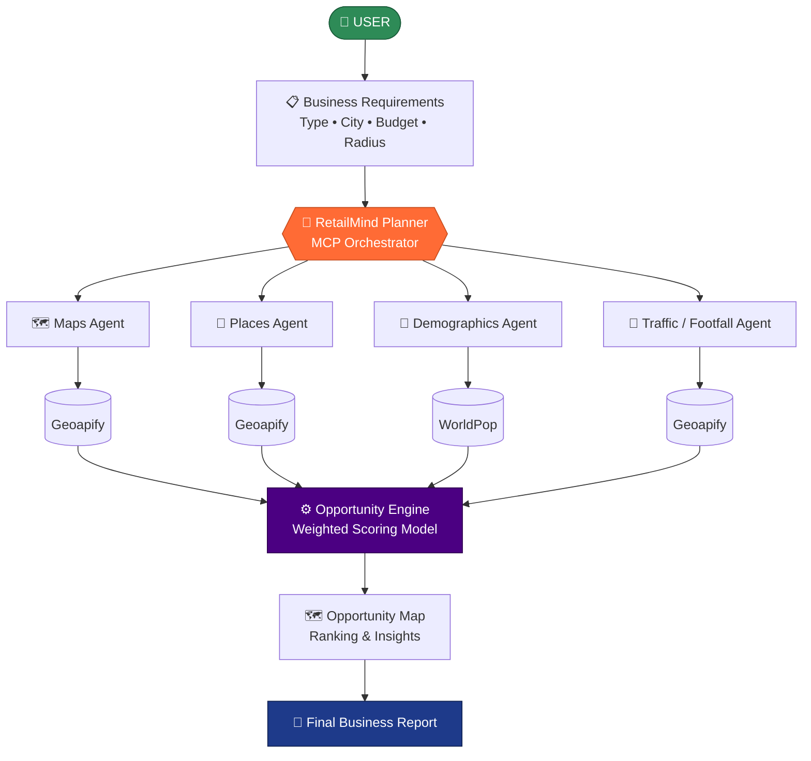

<div align="center">

# 🧠 RetailMind

### **AI-Powered Retail Location Intelligence**

*Discover • Analyze • Compare • Decide*

**From business requirements to location decisions — powered by real-world data and modular location intelligence.**

<br>


</div>

---

## 📖 Overview

**RetailMind** is an AI-powered retail location intelligence system that helps businesses identify promising locations for opening a new retail outlet.

The user provides four simple inputs — **business type, city, investment budget, and search radius**. RetailMind then analyzes multiple candidate locations using real-world and derived data covering nearby competitors, demographics, footfall potential, accessibility, population, and purchasing power.

Built on an **MCP-based modular architecture**, four specialized components — **Maps, Places, Demographics, and Traffic** — collect and process different layers of location intelligence. An **Opportunity Engine** then fuses these signals through a weighted scoring model to rank every candidate zone.

The result: an **Opportunity Score**, a **recommended location**, **ranked alternatives**, an **interactive opportunity map**, **demographic & competition insights**, and an **executive summary** that explains *why* a location wins.

<div align="center">

> ### 🎯 RetailMind doesn't just answer *"Which location should I choose?"*
> ### It answers *"**Why** is this location better than the alternatives?"*

</div>

---

## 📑 Table of Contents

| | | |
|---|---|---|
| [✨ Key Highlights](#-key-highlights) | [🎯 Problem Statement](#-problem-statement) | [💡 Our Solution](#-our-solution--retailmind) |
| [🏗️ System Architecture](#️-system-architecture) | [🤖 Intelligence Components](#-intelligence-components) | [⚙️ Opportunity Engine](#️-opportunity-engine) |
| [🧠 Scoring Model](#-opportunity-scoring-model) | [🔌 MCP Capabilities](#-mcp-capabilities) | [🧰 MCP Tools](#-mcp-tools) |
| [📥 Inputs](#-user-inputs) | [📤 Outputs](#-retailmind-outputs) | [🌐 Data Sources](#-data-sources) |
| [🔄 Workflow](#-end-to-end-workflow) | [📌 Project Status](#-project-status) | [🛠️ Tech Stack](#️-technology--services) |

---

## ✨ Key Highlights

| | Feature | Description |
|:--:|---|---|
| 🤖 | **AI-Powered Location Intelligence** | Identifies promising locations for launching a retail business. |
| 📍 | **Real Location Analysis** | Discovers and evaluates actual candidate areas using geographic data. |
| 🏪 | **Competitor Analysis** | Surfaces nearby competitors and important anchor locations. |
| 👥 | **Demographic Insights** | Factors in population, age profile, and purchasing-power indicators. |
| 🚶 | **Footfall Potential Analysis** | Estimates activity from real nearby facilities, transport, commerce, and education signals. |
| 💰 | **Budget-Aware Insights** | Pairs the user's investment budget with a derived cost-pressure indicator. |
| 🧠 | **Opportunity Scoring Engine** | Fuses multiple factors into a single **0–100 Opportunity Score**. |
| 🏆 | **Ranking & Recommendation** | Compares candidate zones and recommends the strongest opportunity. |
| 🗺️ | **Interactive Opportunity Map** | Visualizes analyzed locations using real geographic coordinates. |
| 📊 | **Decision-Support Report** | Delivers ranked alternatives, risks, suggestions, and an executive summary. |
| 🔌 | **MCP-Based Modular Architecture** | Keeps Maps, Places, Demographics, Traffic, and Scoring independent and extensible. |

---

## 🎯 Problem Statement

Retail businesses often struggle to select the right location because there is no **unified, data-driven approach** for evaluating potential areas.

<table>
<tr><td width="50%" valign="top">

**🔴 Key Challenges**

- 📍 Difficulty identifying suitable locations
- 🏪 Unclear competitor presence
- 👥 Limited demographic insights
- 🚶 Uncertainty about footfall potential
- 📊 Hard to compare multiple locations
- 💡 Heavy reliance on intuition over data

</td><td width="50%" valign="top">

**🟢 What's Needed**

An intelligent system that analyzes all these factors together and recommends the most promising retail location — backed by an **explainable Opportunity Score** rather than gut feel.

</td></tr>
</table>

---

## 💡 Our Solution — RetailMind

RetailMind analyzes multiple candidate areas and recommends the most promising location using real-world data and an explainable **Opportunity Score**.

```
📍 Location Discovery    →  Identifies potential business zones
🏪 Competition Analysis  →  Evaluates nearby competitors and anchor points
👥 Demographic Analysis  →  Studies population, age profile, purchasing power
🚶 Footfall Potential    →  Estimates commercial activity and accessibility
🧠 Opportunity Scoring   →  Combines key factors into a 0–100 score
🏆 Smart Recommendation  →  Ranks locations, recommends the best opportunity
🗺️ Visual Insights       →  Interactive opportunity map + business report
```

---

## 🏗️ System Architecture

RetailMind uses a **multi-agent architecture** where an MCP-based Planner coordinates four specialized components. Their outputs flow into the Opportunity Engine, which scores and ranks every zone before rendering the map and final report.



<details>
<summary><b>📐 View ASCII architecture diagram</b></summary>

```text
                        USER
                         │
                         ▼
                 Business Requirements
       Business Type • City • Budget • Radius
                         │
                         ▼
              ┌──────────────────────┐
              │  RetailMind Planner  │
              │   MCP Orchestrator   │
              └──────────┬───────────┘
                         │
        ┌────────────────┼────────────────┬────────────────┐
        │                │                │                │
        ▼                ▼                ▼                ▼
 ┌────────────┐   ┌────────────┐   ┌──────────────┐  ┌────────────┐
 │ Maps Agent │   │Places Agent│   │ Demographics │  │Traffic /   │
 │            │   │            │   │    Agent     │  │Footfall    │
 └─────┬──────┘   └─────┬──────┘   └──────┬───────┘  └─────┬──────┘
       │                │                 │                │
       ▼                ▼                 ▼                ▼
   Geoapify          Geoapify          WorldPop         Geoapify
       │                │                 │                │
       └────────────────┴────────┬────────┴────────────────┘
                                 │
                                 ▼
                     ┌────────────────────┐
                     │ Opportunity Engine │
                     │ Weighted Scoring   │
                     └──────────┬─────────┘
                                │
                                ▼
                     ┌────────────────────┐
                     │ Opportunity Map    │
                     │ Ranking & Insights │
                     └──────────┬─────────┘
                                │
                                ▼
                     ┌────────────────────┐
                     │ Final Business     │
                     │ Report             │
                     └────────────────────┘
```

</details>

---

## 🤖 Intelligence Components

### 🗺️ 1. Maps Agent — *Location Discovery*

> Responsible for finding **where** to look.

- Identifies candidate retail zones within the selected city and search radius
- Retrieves real geographic locations and coordinates
- Supplies the location set consumed by every downstream component
- **Data source:** Geoapify location/map data

---

### 📍 2. Places Agent — *Competitive Landscape*

> Responsible for understanding **what's already there**.

- Finds nearby competitors matched to the selected business type
- Identifies anchor points and important nearby places
- Evaluates the commercial environment around each zone
- Determines competition level and commercial attractiveness

---

### 👥 3. Demographics Agent — *Who Lives There*

> Responsible for profiling **the customer base**.

- Analyzes population around each candidate location
- Calculates the **18–35 age-group profile**
- Estimates purchasing-power potential from surrounding commercial and affluence signals
- **Data source:** WorldPop population & age data

---

### 🚶 4. Traffic / Footfall Agent — *Customer Movement*

> Responsible for estimating **how busy** a zone is.

Analyzes real nearby facilities across six signal categories:

| | | |
|---|---|---|
| 🚌 Public transport | 🎓 Educational institutions | 🏬 Commercial areas |
| 🍽️ Restaurants & catering | 🎭 Entertainment locations | 🏥 Healthcare facilities |

These accessibility and activity signals are converted into a **Footfall Potential Score**, highlighting zones likely to see stronger customer activity.

> [!NOTE]
> The Footfall Potential Score is a **derived accessibility/activity indicator** — it is *not* a direct pedestrian count.

---

## ⚙️ Opportunity Engine

> **Not an agent** — a deterministic scoring layer.

The Opportunity Engine consumes the outputs of all four analysis components and turns them into a decision.

| Step | Action |
|:--:|---|
| **1** | Combines footfall potential, population, purchasing-power proxy, age profile, competition, and anchor points |
| **2** | Applies the defined **weighted scoring model** |
| **3** | Ranks all candidate zones |
| **4** | Selects the strongest retail location |
| **5** | Generates the final **Opportunity Score** |

---

## 🧠 Opportunity Scoring Model

The final Opportunity Score ranges from **0 to 100**.

| Component | Weight | Contribution |
|---|---:|---|
| 🚶 **Footfall Potential** | **30%** | ██████████████████████████████ |
| 👥 **Population** | **20%** | ████████████████████ |
| 🏪 **Competition** | **20%** | ████████████████████ |
| 💰 **Purchasing Power Proxy** | **15%** | ███████████████ |
| 🧑 **Age 18–35 Profile** | **10%** | ██████████ |
| 📍 **Anchor Points** | **5%** | █████ |
| **Total** | **100%** | |

This multi-dimensional model lets RetailMind compare candidate locations holistically instead of over-fitting to a single factor.

---

## 🔌 MCP Capabilities

RetailMind uses the **Model Context Protocol** to provide a structured, modular workflow between its analysis components.

| Capability | Purpose |
|---|---|
| **🧭 Agent Orchestration** | Coordinates all analysis modules through the RetailMind Planner |
| **🛠️ Tool Execution** | Lets specialized tools perform focused location analysis |
| **📡 Structured Communication** | Standardizes input/output exchange between components |
| **⚡ Real-Time Data Integration** | Connects analysis components to live external data sources |
| **🧩 Modular Architecture** | Allows tools and data providers to be swapped or upgraded independently |

---

## 🧰 MCP Tools

| MCP Tool | Function |
|---|---|
| 🗺️ **Maps Tool** | Discovers candidate zones and geographic locations |
| 📍 **Places Tool** | Finds competitors, POIs, and anchor points |
| 👥 **Demographics Tool** | Retrieves population and age-related demographic data |
| 🚶 **Traffic Tool** | Calculates footfall potential from nearby activity signals |
| ⚙️ **Opportunity Engine** | Combines insights, scores zones, and ranks opportunities |

---

## 📥 User Inputs

RetailMind begins its analysis from four simple inputs.

| Input | Description |
|---|---|
| 🏪 **Business Type** | Type of retail business the user wants to establish |
| 🌆 **City** | Target city for location analysis |
| 💰 **Investment Budget** | Available investment budget |
| 📍 **Search Radius** | Geographic radius used to discover candidate areas |

**Example**

```yaml
Business Type : Coffee Shop
City          : Coimbatore
Budget        : ₹1,00,00,000
Search Radius : 5 km
```

---

## 📤 RetailMind Outputs

<table>
<tr><td width="50%" valign="top">

**🏆 Recommendation**
- Recommended Retail Location
- Opportunity Score (0–100)
- Ranked Candidate Zones
- Interactive Opportunity Map

</td><td width="50%" valign="top">

**📊 Supporting Intelligence**
- Footfall Potential Score
- Demographic Score
- Competition Insights
- Cost-Pressure / Budget Insights
- Potential Risks
- Business Suggestions
- Executive Summary

</td></tr>
</table>

---

## 🌐 Data Sources

| Data Source | Used For |
|---|---|
| **Geoapify** | Geographic locations, candidate zones, POIs, competitors, anchor points, nearby facility/activity signals |
| **WorldPop** | Population and age-related demographic information |
| **RetailMind Derived Models** | Purchasing-power proxy, footfall potential, cost pressure, Opportunity Score |

### 🔍 Data Transparency

> [!IMPORTANT]
> Some RetailMind indicators are **derived rather than directly measured**.

| Indicator | What it actually is |
|---|---|
| **Footfall Potential** | Estimated from nearby accessibility and activity signals — not direct pedestrian counts |
| **Purchasing Power** | A proxy based on surrounding commercial/affluence signals — not measured household income |
| **Cost Pressure** | A directional indicator — not actual locality-level rent data |

This keeps every recommendation **explainable**, with a clear line between observed data and derived indicators.

---

## 🔄 End-to-End Workflow

| Step | Stage | What Happens |
|:--:|---|---|
| **1️⃣** | **User Input** | Business type, city, budget, and search radius are provided |
| **2️⃣** | **RetailMind Planner** | The MCP-based Planner coordinates the full analysis workflow |
| **3️⃣** | **Maps Analysis** | Candidate retail zones and coordinates are discovered |
| **4️⃣** | **Places Analysis** | Competitors, POIs, and commercial anchor points are identified |
| **5️⃣** | **Demographic Analysis** | Population, age profile, and purchasing power are evaluated |
| **6️⃣** | **Footfall Analysis** | Accessibility and activity signals become footfall-potential scores |
| **7️⃣** | **Opportunity Scoring** | The Engine applies the weighted scoring model |
| **8️⃣** | **Zone Ranking** | Candidate zones are ranked by Opportunity Score |
| **9️⃣** | **Opportunity Map** | Results are visualized on real geographic coordinates |
| **🔟** | **Final Report** | Recommendation, alternatives, risks, suggestions, and summary are delivered |

---

## 📊 Core Features

| Core Feature | Description |
|---|---|
| 📍 **Smart Location Discovery** | Identifies potential retail zones based on business requirements |
| 🏪 **Competition Analysis** | Evaluates nearby competitors and commercial anchor points |
| 👥 **Demographic Intelligence** | Analyzes population, age profile, and purchasing-power indicators |
| 🚶 **Footfall Potential Analysis** | Estimates customer activity from accessibility and facility data |
| 🧠 **Opportunity Scoring** | Generates a 0–100 score across multiple location factors |
| 🏆 **Zone Ranking** | Compares candidate zones and recommends the strongest |
| 🗺️ **Opportunity Map** | Visually displays and compares analyzed locations |
| 📊 **Business Insights** | Delivers key insights, risks, suggestions, and a final recommendation |

---

## 🚀 Why RetailMind?

Traditional retail location selection forces businesses to manually investigate accessibility, competitors, population, demographics, commercial activity, customer movement, and cost — **each in isolation**, making real comparison nearly impossible.

**RetailMind brings all of it into one decision-support system.**

<div align="center">

| ❌ Traditional Approach | ✅ RetailMind |
|---|---|
| Scattered, manual research | Unified automated analysis |
| Factors evaluated separately | Multi-factor weighted scoring |
| Gut-feel decisions | Explainable 0–100 score |
| "Which location?" | "Which location — **and why**?" |

</div>

---

## 📌 Project Status

| Component | Status |
|---|:--:|
| 🔌 MCP Server Integration | ✅ Complete |
| 🗺️ Maps Analysis | ✅ Complete |
| 📍 Places & Competitor Analysis | ✅ Complete |
| 👥 Demographic Analysis | ✅ Complete |
| 🚶 Footfall Potential Analysis | ✅ Complete |
| ⚙️ Opportunity Scoring Engine | ✅ Complete |
| 🏆 Candidate Zone Ranking | ✅ Complete |
| 🗺️ Interactive Opportunity Map | ✅ Complete |
| 📊 Business Insights | ✅ Complete |
| 📄 Executive Summary | ✅ Complete |

---

## 🛠️ Technology & Services

<div align="center">

| Layer | Technology |
|---|---|
| **Language** | TypeScript |
| **Framework** | NitroStack |
| **Protocol** | Model Context Protocol (MCP) |
| **Tooling** | NitroStudio |
| **Geospatial Data** | Geoapify API |
| **Demographic Data** | WorldPop |
| **Interface** | Interactive Map / Widget UI |
| **Design** | Modular service-based architecture |

</div>

---

## 🎯 Final Goal

RetailMind aims to transform complex location information into **clear, actionable retail intelligence** — so businesses can make informed, defensible decisions when choosing where to open their next outlet.

---

<div align="center">

## 🧠 RetailMind

### *AI-Powered Retail Location Intelligence*

**Discover • Analyze • Compare • Decide**

*From business requirements to location decisions — powered by real-world data and modular location intelligence.*

</div>